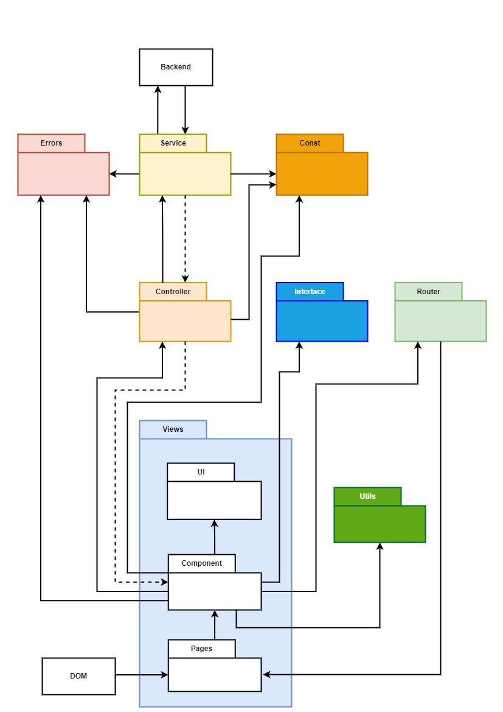
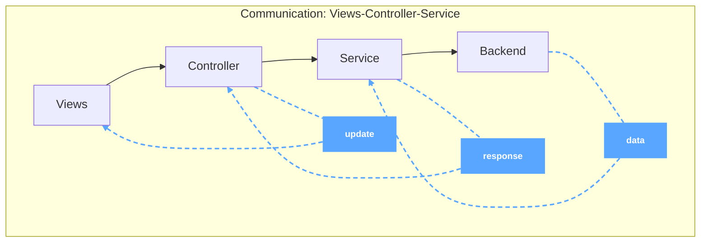

# Architectuur van ToDo app

In het voorbeeld is de architectuur van de ToDo app in kaart gebracht, waarbij verschillende verantwoordelijkheden zijn ingedeeld binnen de betreffende (sub)folders.

## Techstack

- vue
- typescript
- tailwind
- vite

---

## Views

Zoals te zien is, hebben alleen de DOM en de Router folders associatie met de `Pages` subfolder (weergegeven als subfolder binnen de `Views`, waarbij deze folder in lichtblauw is weergegeven).

De `Pages` subfolder heeft alleen de verantwoordelijkheid om de gerenderde componenten weer te geven, waarvan die in de `Component` subfolder zijn opgezet (waarvan deze subfolder ook in de `Views` folder wordt weergegeven).

De `Router` folder heeft als verantwoordelijkheid navigatielinks te beheren, zodat er een mogelijkheid is om naar verschillende (sub)pagina's te navigeren.

De `UI` subfolder is alleen bekend bij de `Component` subfolder. Dit komt omdat de `UI` subfolder element, zoals knoppen, selectie dropdown, container, etc. bevat waarbij deze binnen de `Component` hergebruikt kunnen worden.

### Component subfolder

De `Component` is de belangrijktste subfolder binnen de `Views` omdat deze de kern is van alle gemaakte webcomponenten die de eindgebruiker te zien krijgt. Vanaf deze subfolder worden er associaties naar andere folders gelegd om het volgende genoemde zaken af te kunnen handelen:

- Component --> Controller:
  De `Component` stuurt een opdracht naar de `Controller`, waarnaar deze de desbetreffende fuctie uitvoert om een call uit te voeren naar het andere functie die in de `Service` folder staat. Meer hierover, zie `Controller`
   

- Component --> Utils:
  De `Component` maakt gebruikt van de `Utils` omdat deze functies bevatten waarvan deze puur zijn. Dit betekent dat de fuctie die hierin zijn opgesteld geen side-effects bevatten en de resultaten altijd hetzelfde blijven op basis
   

- Component --> Router:
  De `Component` mag als enige associatie hebben met de `Router`. Dit heeft te maken omdat binnen de `Component` subfolder webcomponenten aanwezig zijn zoals een navigatiebar en knop-navigaties.
   

- Component --> Interface:
  De `Component` heeft relatie met de `Interface` omdat hier in types voor properties zijn bepaald moet worden voldaan.
   

- Component --> Const:
  De `Component` maakt gebruik van de folder `Const` omdat deze variabelen bevat waarbij de waarde vooraf zijn gedeclareerd en altijd constant blijft
   

- Compontent --> Errors:
  De `Component` maakt gebruik van de `Errors` folder waarin het mogelijk is de excepties meer te specificeren.

---

## Controller

De `Controller` folder heeft de verantwoordelijkheid om als een middelpersoon te dienen tussen de subfolder `Component` en `Service`. De controller vangt de aanroepen vanuit de componenten op en stuurt deze door naar de juiste `Service` afhandeling.

Met deze aanpak behoudt de component de focus op de view kant (of ook wel de UI en webcomponenten), terwijl de controller de koppeling de datalogica en interacties, zoals requests of responses, afhandelt.

## Service
