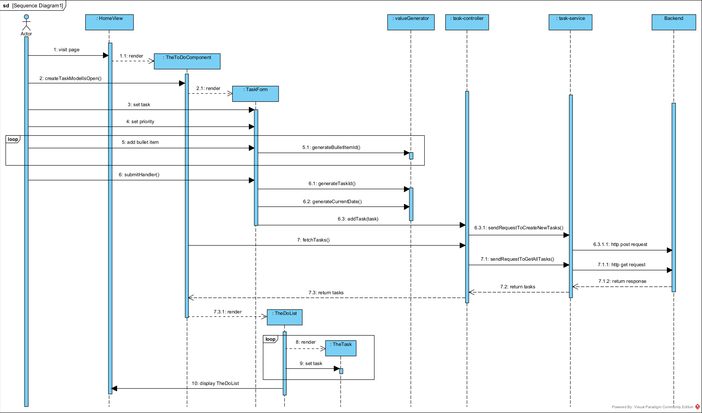

# Sequence Task

**Note:**
Omdat de focus in deze diagrammen op de frontend ligt, zijn de stappen die zich in de backend afspelen geabstraheerd. Dit wil zeggen dat we in deze modellen ervan uitgaan dat de backend correct is opgezet waarbij de de verzoeken van de frontend kan ontvangen, deze verder afhandeld en vervolgens een response terugstuurt.

Vanuit deze gedachtegang is er voor dit project ook geen backend opgezet. In plaats daarvan wordt er een tool `json-server` gebruikt – terug te vinden in de `package.json` – om hiermee een mock database te simuleren.

Dit betekent, wanneer er later kan worden gekozen om een echte database te gebruiken, dat er niet veel wijzigingen aan de frontend hoeven worden gedaan. Mogelijk hoeven alleen de host en de port - afhankelijk van hoe dit in de backend is ingesteld - te worden aangepast om met de backend te kunnen communiceren.

---

## Get All Task

Volgens de volgorde van deze diagram begint de proces bij de `Actor` die een pagina bezoekt genaamd `HomeView`. Automatisch bij het bezoeken van deze pagina wordt de component `TheToDoComponent` gerenderd, waarin de eerste logica beginnen af te spelen.

Tussen de `TheToDoComponent` en `task-controller` wordt er direct een fetch gedaan met de `fetchTasks()` en opgevolgd met `sendRequestToGetAllTasks()`. Met deze `GET` request zou de backend data moeten aanleveren, mits deze in de databron aanwezig is.

Naar aanleiding van deze `GET` request wordt en altijd een response teruggegeven (ook als deze databron voor dit scenario geen data van de `Task` bevat).

Naar aanleiding dat de backend een response geeft wordt hiervan een payload opgezet. Deze wordt verder doorgegeven doorgeven als een lijst van de bevondingen om op basis hiervan de component `TheToDoList` te renderen.

Deze lijst bevat een conditie, waarmee hier wordt gekeken of de lijst niet leeg is.

- Als de lijst niet leeg is wordt er component gerenderd (genaamd `TheTask`), waarvan deze de logica bevat om de payload op te zetten naar aanleiding van de ID.

- Als de lijst leeg is wordt de component `BaseNotification` gerenderd. In tegenstelling tot een niet lege lijst, wordt deze component altijd een keer gerenderd

Ongeact wat de uitkomst is van deze afhandeling, wordt er altijd een van deze twee boven genoemde condities één of meerdere componenten im de `TheToDoComponent` gerenderd (afhankelijk van hoeveel items in de lijst zitten), waarvan de actor deze te zien krijgt.

---

## Add task

